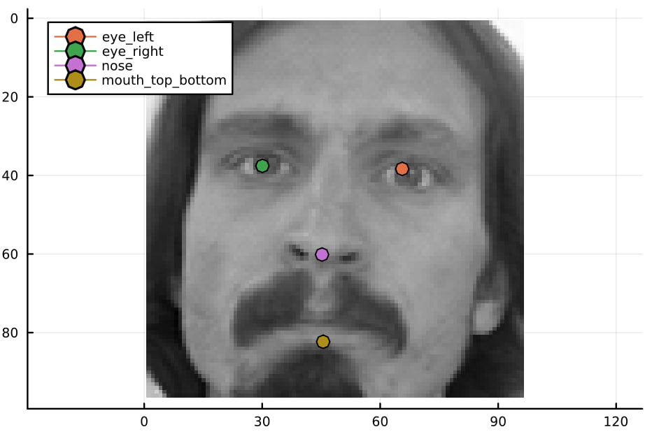
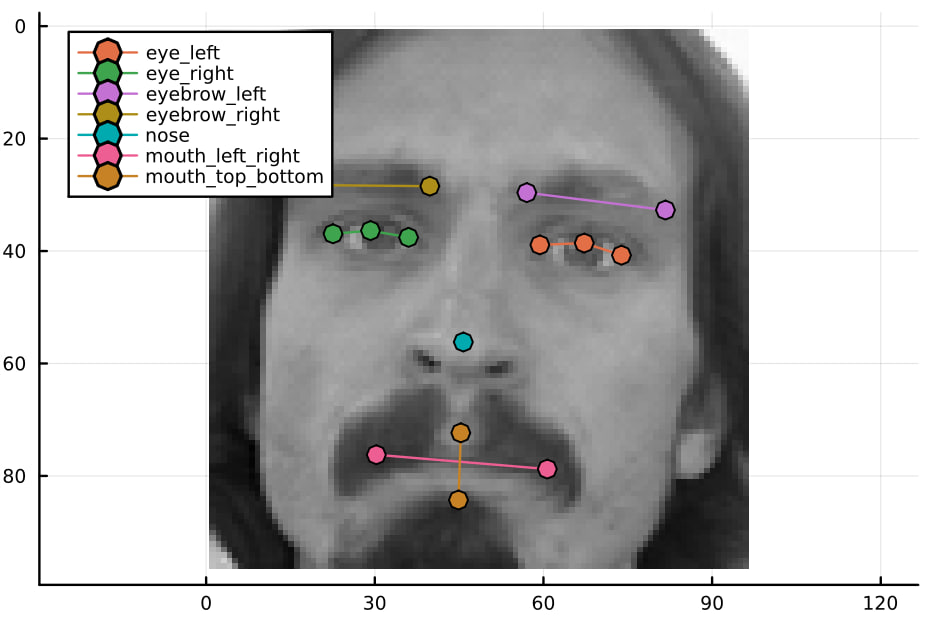

# KeypointsDetection

The project is composed of two parts:
1. Training and Evaluation of the model for [Facial Keypoints Detection](https://www.kaggle.com/competitions/facial-keypoints-detection/overview) from Kaggle.
2. Proof of concept implementation of a pipeline for detecting facial keypoints on image-stream captured by a pc webcam.

# Installation

```julia
(@v1.8) pkg> add https://github.com/B0B36JUL-FinalProjects-2022/Projekt_Trebuna
```

## [Facial Keypoints Detection](https://www.kaggle.com/competitions/facial-keypoints-detection/overview)

The package exports several utility functions for training of the models on the challenge.

### Data Loading
- `load_train_dataframe`, `augment_dataframe`, `create_train_dataset`

### Training and Evaluation
- model definitions: `define_net_simple_feedforward`, `define_net_lenet`, `define_net_lenet_dropout`
- training: `train_net!`, `train_gpu_net!`, `show_losses`
- evaluation: `predict_to_dataframe`, `show_image_and_keypoints`, `show_image_with_gold`, `show_errors`

### Results

I was able to replicate the performances reported by the official tutorial from kaggle ([link](https://danielnouri.org/notes/2014/12/17/using-convolutional-neural-nets-to-detect-facial-keypoints-tutorial/)). The models can be trained by scripts [`examples/trainTraitsDetector.jl`](examples/trainTraitsDetector.jl) for the basic traits (e.g. detect just eyes, nose, and the middle of mouth), and [`examples/trainTraitsDetectorFull.jl`](examples/trainTraitsDetectorFull.jl) for all the traits.

The reported Root Mean Squared Error in my validation dataset is: 2.35 on the augmented validation dataset. (The tutorial reports: 2.17 on the kaggle leaderboard)

#### Example outputsThe face bounding box for the transformed image is predicted
- basic traits:

- full traits:


## Proof of Concept WebCam Pipeline

The main aim of this part is to try to play with `VideoIO`, `GLMakie`, and `ObjectDetector`. The pipeline works as follows:
1. Image is taken on the webcam of my pc
2. Image is transformed to fit into 416x416x3 size needed by the yolo model
3. The face bounding box for the transformed image is predicted.
4. The face is cropped out of the webcam image and transformed to shape 96x96x1 for facial keypoints recoginition.
5. The predictions of the net are transformed back to the coordinates of the original image
6. The image is displayed.

A demonstration of the pipeline can be found in [examples/applicationWorkflow.jl](examples/applicationWorkflow.jl), a working proof of concept is in [examples/webcam.jl](examples/webcam.jl). The `gif` image below shows the output of the `webcam` script.


### TODOs

- webcam connection [x]
- a model which detects everything at once [x]
- a model detecting just the basic traits [x]
- using `ObjectDetector.jl` to extract  faces from the webcam image [x]
- resizing and adjusting extracted faces to fit into trained model [x]
- add `@require` macros to reduce load time of packages [x]
- tests [x]
- docstrings [x]
- automatic download of YOLO model [-]
- faster start time using precompilation [-]
    - won't do as I do not want to spend time on sysimages
- ResNet for traits detection [ ]

### References

- [tutorial on facial keypoints recognition](https://danielnouri.org/notes/2014/12/17/using-convolutional-neural-nets-to-detect-facial-keypoints-tutorial/)
- [pretrained weights for yolo for facial detection](https://github.com/lthquy/Yolov3-tiny-Face-weights)
- [how to define yolo](https://jonathan-hui.medium.com/real-time-object-detection-with-yolo-yolov2-28b1b93e2088)

### Issues

#### `GLMakie`
- it was needed to create an environment variable: `export LD_PRELOAD=/usr/lib/x86_64-linux-gnu/libstdc++.so.6` because `julia` kept using the wrong version of `libstdc++`  